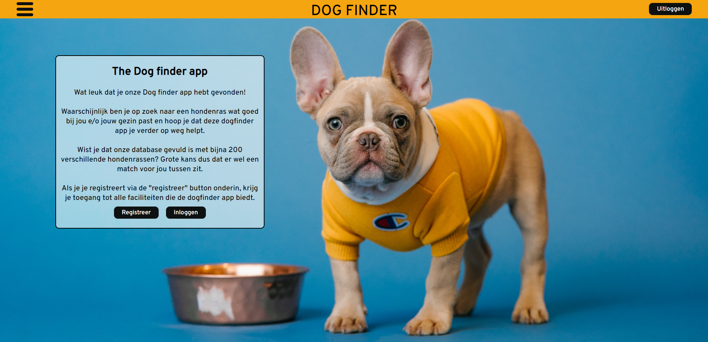

<br/>
<section align="center">
  <a href="https://github.com/Arnoud-Wilson/Dogfinder-app">
    
  </a>

<h3 align="center">Dogfinder app</h3>

  <p align="center">
    If you want to know everything about dog breeds, this is the app for you!
    <br/>
    <br/>
  </p>
</section>

## Table Of Contents

* [About the Project](#about-the-project)
* [Built With](#built-with)
* [Getting Started](#getting-started)
  * [Installation](#installation)
* [Usage](#usage)
* [Contributing](#contributing)
* [Authors](#authors)
* [Acknowledgements](#acknowledgements)

## About The Project



Dogs are amazing and fun to be around with. But when you think about getting a dog for yourself, it gets a little complicated.

Here's why:

* There are so many different breeds of dogs.
* All the breeds have other characteristics.
* Not every dog breed is a good match between owner and dog.

Butt there is no need to stress because we created the Dogfinder app, so you can search for the best dog breed for your situation.

## Built With

HTML, CSS, JavaScript and ReactJs

## Getting Started

### `npm start`

Runs the app in the development mode.\
Open [http://localhost:3000](http://localhost:3000) to view it in your browser.

The page will reload when you make changes.\
You may also see any lint errors in the console.

### `npm test`

Launches the test runner in the interactive watch mode.\
See the section about [running tests](https://facebook.github.io/create-react-app/docs/running-tests) for more information.

### `npm run build`

Builds the app for production to the `build` folder.\
It correctly bundles React in production mode and optimizes the build for the best performance.

The build is minified and the filenames include the hashes.\
Your app is ready to be deployed!

See the section about [deployment](https://facebook.github.io/create-react-app/docs/deployment) for more information.

### `npm run eject`

**Note: this is a one-way operation. Once you `eject`, you can't go back!**

If you aren't satisfied with the build tool and configuration choices, you can `eject` at any time. This command will remove the single build dependency from your project.

Instead, it will copy all the configuration files and the transitive dependencies (webpack, Babel, ESLint, etc) right into your project so you have full control over them. All of the commands except `eject` will still work, but they will point to the copied scripts so you can tweak them. At this point you're on your own.

You don't have to ever use `eject`. The curated feature set is suitable for small and middle deployments, and you shouldn't feel obligated to use this feature. However we understand that this tool wouldn't be useful if you couldn't customize it when you are ready for it.

## Learn More

You can learn more in the [Create React App documentation](https://facebook.github.io/create-react-app/docs/getting-started).

To learn React, check out the [React documentation](https://reactjs.org/).

To learn about nodeJS, check out [NodeJS documentation](https://nodejs.org/en/docs).

To learn about npm, [npm documentation](https://docs.npmjs.com/)

## Installation

1. Get a free API Key at [https://api-ninjas.com.com](https://api-ninjas.com/api/dogs)

2. Clone the repo

```sh
git clone https://github.com/Arnoud-Wilson/Dogfinder-app.git
```

3. Install NPM packages

```sh
npm install
```

4. Enter your API in `.env`

```JS
REACT_APP_API_KEY = "enter your API key here";
```

## Usage

To use all features of this Dogfinder app you need an account and you need to be signed in.

## Contributing

Contributions are what make the open source community such an amazing place to be learn, inspire, and create. Any contributions you make are **greatly appreciated**.
* If you have suggestions for adding or removing stuff, feel free to discuss it, or directly create a pull request.
* Please make sure you check your spelling and grammar.
* Create individual PR for each suggestion.

### Creating A Pull Request

1. Fork the Project
2. Create your Feature Branch (`git checkout -b feature/AmazingFeature`)
3. Commit your Changes (`git commit -m 'Add some AmazingFeature'`)
4. Push to the Branch (`git push origin feature/AmazingFeature`)
5. Open a Pull Request

## Authors

* [Arnoud Wilson](https://arnoudwilson.com) Full-stack development student at [NOVI](https://www.novi.nl/).

## Acknowledgements

* This project was bootstrapped with [Create React App](https://github.com/facebook/create-react-app).
* The docs for the backend of this app can be found at: [NOVI](https://github.com/hogeschoolnovi/novi-educational-backend-documentation).
* [API ninjas](https://api-ninjas.com/) and [The dog API](https://thedogapi.com/) for the delivery of the dog breeds data.
* [react-burger-menu](https://www.npmjs.com/package/react-burger-menu) for the nice burger menu.
* [axios](https://www.npmjs.com/package/axios) for the promise based HTTP client for the browser and node.js
* [Karsten Winegeart](https://unsplash.com/@karsten116) for the nice background picture.

